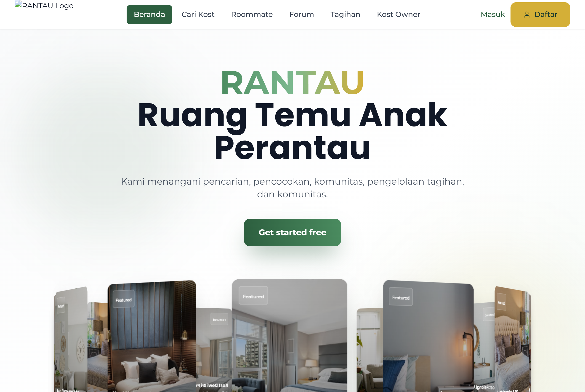

# PERINTIS — RANTAU (Team Dev Repo)

The team development repository for **RANTAU — Ruang Temu Anak Perantau**, our project for the PRISMA Competition 2025. RANTAU is a web platform for students living away from home in Bali: find a boarding house (*kost*), match with a compatible roommate, split shared bills, and connect through a community forum. The app lives in [`rantau-website/`](./rantau-website).



## Features

- **Smart Kost Finder** — interactive quiz or explore mode, with an interactive map
- **Roommate Matching** — compatibility-based matching by lifestyle and habits
- **Bill Splitter & Reminders** — manage shared costs with housemates
- **Community Forum** — share stories and tips with fellow perantau
- **Personal profile & dashboard**

## Tech stack

React · Vite · TypeScript · Tailwind CSS · Framer Motion · React Leaflet · Lucide

## Run locally

```bash
git clone https://github.com/GianneAngely/PERINTIS.git
cd PERINTIS/rantau-website
npm install
npm run dev
```

## Note

This is the collaborative development repo (built as team *Perintis*). The polished competition build also lives at [`Prisma-Competition-2025-Rantau`](https://github.com/GianneAngely/Prisma-Competition-2025-Rantau).
